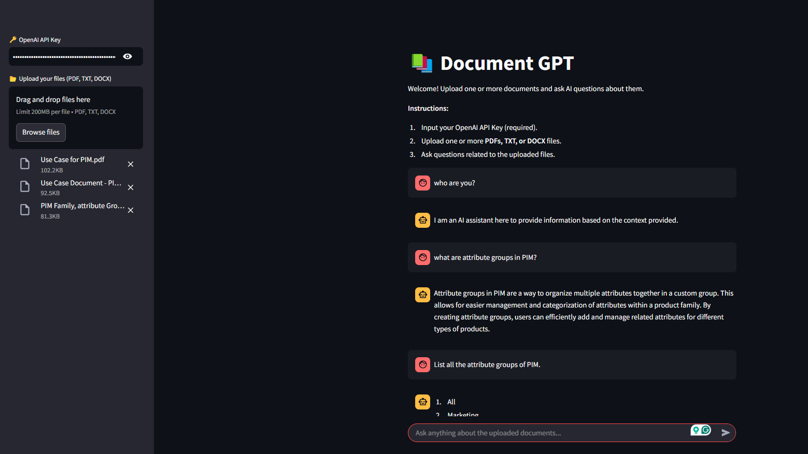

# Document-GPT
Chatbot to ask questions to AI about your files. Built using Python, LangChain, Streamlit, and Open AI. 



## Setting up the Project

```bash
# Make sure you have Python and Git installed in your machine
# Clone the repo in your repective foler
$ git clone https://github.com/humairshoukat/Document-GPT

# After successfully cloning the repo, go the project folder
$ cd Document-GPT

# Setup the virtual environment
$ python -m venv venv

# Activate the virtual environment
$ venv\Scripts\activate  # For Windows
$ source venv/bin/activate  # For Mac & Linux

# If you're unable to activate the venv OR if you get the error running/execution scripts are disabled,
# If you're using windows, Fix it by following the below instruction:
# Open your Windows Powershell by running it as Administrator and run the following command and enter 'Y':
$ Set-ExecutionPolicy RemoteSigned
# Issue will get fixed, and now activate the virtual environment again and follow the next instructions.

```

## Running the Project

```bash
# Install the requirements
$ pip install -r requirements.txt

# Create a .env file by using example.env file from the project files (No need if there is no example env file)

# Run the app
$ streamlit run app.py

# Your can access the app on the following URL
$ http://localhost:8501/

```